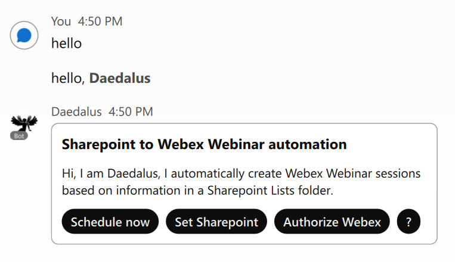
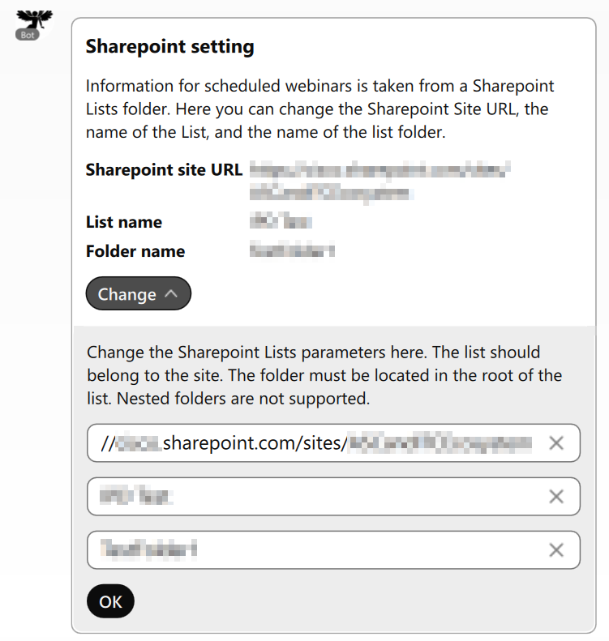
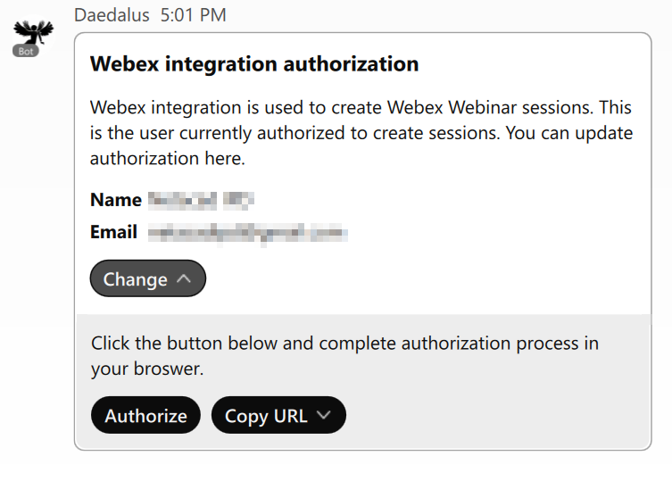
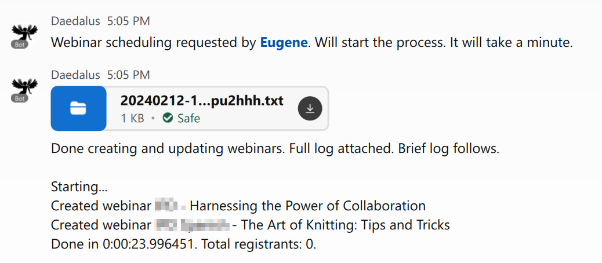

===========
Get Started
===========

Getting Access to Services
==========================
This application uses three different services. You need to provide credentials for all three.

Sharepoint
----------
To get the Sharepoint API Client ID and Client Secret:

#. Go to `Azure Portal <https://portal.azure.com/>`_ and sign in.
#. Navigate to Azure Active Directory > App registrations.
#. Click New registration.
#. Enter an application name and select Accounts in this organizational directory only.
#. Under Redirect URI, select Web and enter ``https://localhost`` (this application does not use callback).
#. Click Register.
#. Copy the Application (client) ID.
#. Go to Certificates & secrets > Client secrets > New client secret.
#. Add a description, select expiration, and click Add.
#. Copy the client secret Value immediately (it won't be shown again).
#. Go to API permissions > Add a permission > Microsoft Graph > Application permissions.
#. Add Sites.Read.All and Sites.ReadWrite.All permissions.
#. Click Grant admin consent for your organization.

Webex Integration
-----------------
To create a new Webex Integration:

#. Go to `developer.webex.com <https://developer.webex.com/>`_ and sign in.
#. From the top right menu under your profile icon, select My Webex Apps.
#. Click Create a New App, and then Create an Integration.
#. Input integration name, icon and description.
#. Input Redirect URIs for OAuth. For local testing, that can be ``http://localhost:5000/callback`` For production, input your web application URL + ``/callback``.
#. Mark the following scopes that are required by application and Save:

    * ``meeting:schedules_read``
    * ``meeting:schedules_write``
    * ``meeting:recordings_read``
    * ``meeting:preferences_read``
    * ``meeting:participants_read``
#. Copy the Client ID and Client Secret.

Webex bot
---------
To create a new Webex bot identity:

#. Go to `developer.webex.com <https://developer.webex.com/>`_ and sign in.
#. From the top right menu under your profile icon, select My Webex Apps.
#. Click Create a New App, and then Create a Bot.
#. Input bot name, username, icon and description.
#. Copy the bot access token.

Setting Environment Variables
=============================
You must set a few environment variables.

Required Variables
------------------
* ``SHAREPOINT_CLIENT_ID`` - Sharepoint application Client ID
* ``SHAREPOINT_CLIENT_SECRET`` - Sharepoint application Client Secret
* ``WEBEX_INTEGRATION_CLIENT_ID`` - Webex integration Client ID value
* ``WEBEX_INTEGRATION_CLIENT_SECRET`` - Webex integration Client Secret
* ``WEBEX_BOT_TOKEN`` - Webex bot access token
* ``WEBEX_BOT_ROOM_ID`` - Webex bot room ID. This bot can only be used in one Webex room. The room can be a direct or a group room.

Optional Variables
------------------
* ``SHAREPOINT_PARAMS`` - a JSON string according to the template. You can use this to customize default Sharepoint Lists column titles and set nicknames for hosts and panelists.
.. code-block:: json

    {
        "columns": {
            "create": "Create", 
            "startdatetime": "Start Date and Time (UTC)",
            "title": "Full Title for Webex Event", 
            "agenda": "Description",
            "cohosts": "Host",
            "panelists": "Presenters (comma separated +<email>)",
            "webinarId": "Webinar ID",
            "attendeeUrl": "Webex Attendee URL",
            "hostKey": "Host Key",
            "registrantCount": "Registrant Count"
        },
        "nicknames": {
            "john": {
                "email": "john.doe@example.com",
                "name": "John Doe"
            }
        }
    }

* ``WEBEX_INTEGRATION_PARAMS`` - a JSON string according to the template. Use this to customize default Webex integration parameters, such as ``siteUrl``, ``panelistPassword``, webinar attendee ``password``, ``reminderTime`` and so on.
.. code-block:: json

    {
        "siteUrl": "mysite.webex.com", 
        "panelistPassword": "passwordforpanelists", 
        "password": "passwordforattendees",
        "reminderTime": 30,
        "alwaysInvitePanelists" : "Calendar <calendar@example.com>",
        "noCohosts": false
    }

Optional Deployment Variables
-----------------------------
If this application is deployed to AWS EC2 instance directly, there is no need to do anything. It will obtain the public domain name from AWS IMDS service.
But if it is deployed with AWS Elastic Beanstalk, the EB environment public domain must be specified in environment.

* ``WEBAPP_PUBLIC_DOMAIN_NAME`` - web application public domain name

This application stores Sharepoint configuration and Webex integration credentials in AWS, supporting both SSM Parameter Store and Secrets Manager.

* ``AWS_SECRET_STORE`` - AWS storage backend (set to ``secretsmanager`` or defaults to ``ssm``)

Starting the application
========================

Start the bot by launching ``web.py``. 

Setting Up and Launching
========================

Initialize the bot by @mentioning it and follow instructions on the cards. 

Using the **Set Sharepoint** action button, you can set the working Sharepoint List details: Sharepoint site URL, List name, and working folder name.

Authorize this automation to create webinars on behalf of a user. The authorization form will open in web browser.

Populate your Sharepoint list with webinar data, change ``Create`` to ``yes`` and launch automation with **Schedule now** button.

.. image:: images/sharepoint-prepare.gif
    :width: 1500
    :alt: How to populate a Sharepoint list with webinar details and mark webinar for creation.

Your webinars are now scheduled.

.. image:: images/sharepoint-complete.gif
    :width: 1500
    :alt: Webinars are created and the Sharepoint list is populated with the webinar IDs and details.
